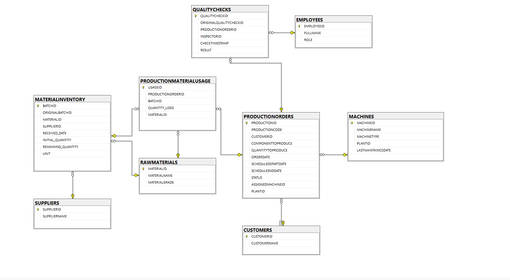

# Manufacturing Data Warehouse: End-to-End ETL & Relational Migration

## 📌 Project Overview
I built this project to solve a messy, real-world operational challenge: migrating an expanding manufacturing plant away from disconnected Excel sheets and into a centralized relational database. 

### The Problem I Solved
The factory was using standalone spreadsheets to track everything from inventory and supplier details to machine schedules. This created major operational headaches:
* **Traceability Issues:** There were no unique IDs for raw material batches, making it impossible to track defects back to a specific supplier.
* **Scheduling Overlaps:** Because the data was disconnected, production lines were frequently double-booked on machines that were actually down for maintenance.
* **Messy Data Entries:** Data quality was highly inconsistent. For example, text fields mixed metric variants like `Kg`, `KG`, and `Kilogram`, or naming variations like `SS-304` and `Stainless 304`.

**My Solution:** I designed a normalized relational database in SQL Server (T-SQL) from scratch, wrote an ETL pipeline to clean and migrate the legacy spreadsheet rows, and added automated database logic to prevent future scheduling or stock errors.

---

## 📊 Database Architecture & Design
I transformed the unstructured spreadsheet rows into a highly normalized relational schema. My design focuses on isolating master dimensions (Suppliers, Customers, Employees, Machines) from the high-velocity transactional records (Production, Inventory, Quality Checks).

### Entity-Relationship Diagram (ERD)
Here is how I structured the database tables and mapped out their primary and foreign key connections:



### Key Structural Decisions I Made:
* **Centralizing Production (`PRODUCTIONORDERS`):** This serves as the main transactional hub, linking customer orders directly to specific machine assets, active timelines, and production statuses.
* **Handling Many-to-Many Relationships (`PRODUCTIONMATERIALUSAGE`):** I created this bridge table to link specific production runs to exact raw material batches, enabling granular, end-to-end component traceability.
* **Inventory Decoupling:** I separated raw material *specifications* (`RAWMATERIALS`) from physical *stock batches* (`MATERIALINVENTORY`), which allows the factory to buy the same type of material from multiple suppliers seamlessly.

---

## 📂 Repository File Structure
I organized this repository into clean, functional scripts that follow standard database development practices:

```text
├── README.md                           <-- Project overview and documentation
├── assets/
│   └── erd.png                         <-- Database ER Diagram image
├── data/
│   └── raw_data.csv                    <-- The uncleaned legacy spreadsheet dataset
├── sql_scripts/
│   ├── 1_schema_creation.sql           <-- Table structures, data types, and hard constraints
│   ├── 2_data_cleaning_etl.sql         <-- Data profiling, text standardization, and prep scripts
│   ├── 3_data_migration.sql            <-- Multi-table JOIN mappings and data ingestion
│   └── 4_business_automation.sql       <-- Database triggers and automated validation logic
└── complete_implementation/
    └── end_to_end_project.sql          <-- My entire, end-to-end original deployment script
```

---

## 🛠️ Code Deep Dive & Practical Examples

### 1. Data Cleaning & Standardization (ETL Phase)
Since data analysts spend most of their time cleaning data, I dedicated a significant part of this project to data prep. In this step, I standardized text-case variances and stripped out corrupt characters like currency signs so I could safely cast fields into appropriate data types:

```sql
-- Standardizing multi-format naming variants into clean, unified names
UPDATE DUMMY
SET SUPPLIERNAME = LTRIM(RTRIM(
    CASE
        WHEN SUPPLIERNAME LIKE '%PlasticPro%' THEN 'PlasticPro Inc.'
        WHEN SUPPLIERNAME LIKE 'Steel Corp%' THEN 'SteelCorp'
        WHEN SUPPLIERNAME LIKE 'Copper Co%' THEN 'CopperCo'
        WHEN SUPPLIERNAME LIKE 'Alu Works%' THEN 'AluWorks'
        WHEN SUPPLIERNAME LIKE '%GlobalMetals%' THEN 'Global Metals'
        ELSE SUPPLIERNAME
    END
));

-- Stripping non-numeric characters (\$ and commas) to execute a safe numeric cast
SELECT INITIALQUANTITY,
       CAST(CAST(REPLACE(REPLACE(REPLACE(INITIALQUANTITY, '\$', ''), ',', ''), ' ', '') AS FLOAT) AS DECIMAL(10,2)) 
FROM ABC_10000 
WHERE InitialQuantity NOT LIKE '%[^0-9.]%';
```

### 2. Multi-Table Relational Migration
During the actual migration, I wrote queries to transform flat rows into relational structures. I used Common Table Expressions (CTEs) to clean up inconsistent units of measure (like mapping `KGS` and `Kilogram` down to a single `KG` standard) on the fly while generating foreign key relationships:

```sql
WITH CleanedInventory_CTE AS (
    SELECT 
        LEFT(RAWMATERIALBATCHID, 7) AS RAWMATERIALBATCHID,
        TRY_CONVERT(DATE, RECEIVEDATE, 105) AS RECEIVEDDATE,
        CAST(CAST(REPLACE(REPLACE(REPLACE(INITIALQUANTITY, '\$', ''), ',', ''), ' ', '') AS FLOAT) AS DECIMAL(10,2)) AS INITIAL_QUANTITY,
        CASE
            WHEN UPPER(TRIM(UNIT)) IN ('KG','KILOGRAM','KGS') THEN 'KG'
            WHEN UPPER(TRIM(UNIT)) IN ('M','METERS','METER') THEN 'M'
            WHEN UPPER(TRIM(UNIT)) IN ('PCS','PIECES') THEN 'PCS'
            ELSE NULL
        END AS STANDARDUNIT, 
        SUPPLIERNAME, MATERIALNAME, MATERIALGRADE
    FROM DUMMY
)
INSERT INTO MATERIALINVENTORY(ORIGINALBATCHID, MATERIALID, SUPPLIERID, RECEIVED_DATE, INITIAL_QUANTITY, UNIT)
SELECT 
    T.RAWMATERIALBATCHID, M.MATERIALID, S.SUPPLIERID, T.RECEIVEDDATE, T.INITIAL_QUANTITY, T.STANDARDUNIT 
FROM CleanedInventory_CTE AS T 
INNER JOIN SUPPLIERS AS S ON S.SUPPLIERNAME = T.SUPPLIERNAME
INNER JOIN RAWMATERIALS AS M ON M.MATERIALGRADE = T.MATERIALGRADE AND M.MATERIALNAME = T.MATERIALNAME;
```

### 3. Business Automation (Database Triggers)
To protect data integrity moving forward, I coded automated business rules directly into the database using T-SQL triggers. This ensures that the system handles errors automatically without relying on external software frontends:

* **Anti-Double Booking (`TRG_CHECKMACHINESCHEDULE`)**: This trigger automatically screens incoming production orders against active machine timelines. If it detects an overlapping schedule on the same machine, it instantly blocks the entry and rolls back the transaction.
* **Failsafe Inventory Tracker (`TRG_UPDATEMATERIALREMAINING`)**: Every time material is used, this trigger automatically updates the remaining inventory. If stock levels ever drop below zero, it aborts the entry to prevent negative inventory bugs.
* **Proactive Supply Chain Alerts (`TRG_LOWSTOCK`)**: I designed this trigger to act as an automated monitoring tool. The moment an active batch drops below 500 units, it automatically inserts a reorder alert entry into a logistics ticket log.

---

## 📈 Analytical Business Insights
By structuring the data this way, I created a single source of truth that allows data analysts to answer critical operational questions instantly with sub-second queries:
1. **Overall Equipment Effectiveness (OEE):** Compares production durations directly against logged machine downtime to analyze asset availability.
2. **Supplier Quality Scorecards:** Joins inspection results back to batch vendors to rank suppliers by their real-world defect rates.
3. **Inventory Burn Rates:** Aggregates material consumption trends across historical production runs to optimize reorder thresholds.

---

## 🛠️ Technical Tool Stack
* **Database Engine:** Microsoft SQL Server (T-SQL)
* **IDE / Workspace:** SQL Server Management Studio (SSMS)
* **Modeling Tool:** Microsoft SQL Server Database Diagram Designer


  
